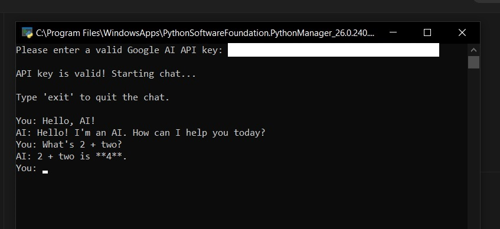
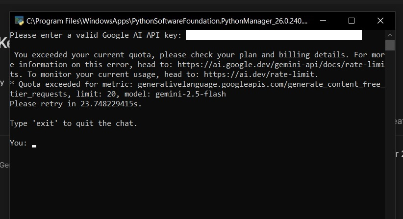

# Google-AI-API

google_ai/          # Python app that uses the Google AI API\
│\
├─ main.py          # App\
├─ READ ME.txt      # Info\
├─ lib/             # folder where Python libraries are installed

